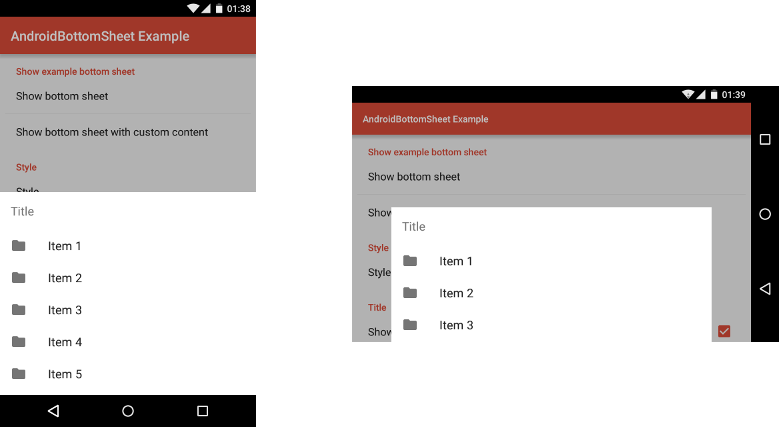
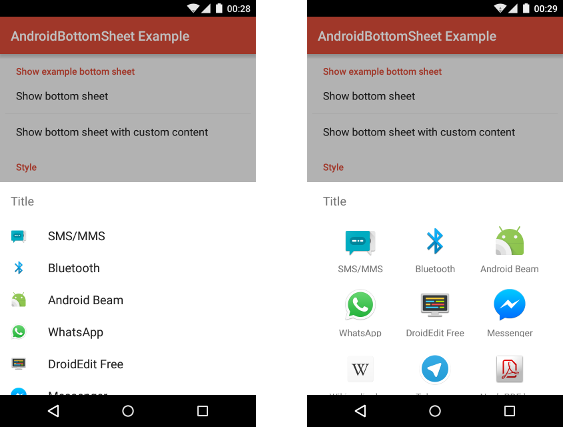
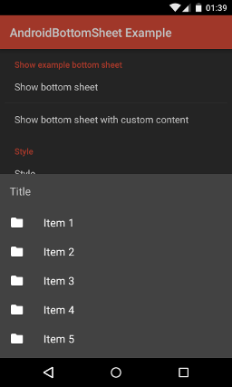

# AndroidBottomSheet - README

"AndroidBottomSheet" is an Android-library, which provides a bottom sheet as a proposed by Android's Material design guidelines (see [here](http://www.google.com/design/spec/components/bottom-sheets.html) for further details), which even works on pre-Lollipop devices. A bottom sheet is supposed to contain menu items, which can be clicked by the user. By default only a few items are shown, but by dragging the bottom sheet, it can be expanded to display all items. The following screenshot shows the appearance of a bottom sheet, which has been created by using the library:



The library provides the following features:

- The library provides a builder, which allows to create bottom sheets by specifying a title, icon, items etc.
- A bottom sheet's items can be displayed as a list, as a two-columned list or as a grid.
- It is possible to separate a bottom sheet's items by adding dividers (with optional titles).
- The library offers a possibility to display all applications, which are suited for handling an Intent, as a bottom sheet's items
- The items of a bottom sheet can be enabled/disabled individually.
- As an alternative to displaying items, a bottom sheet's items can be be replaced with a custom view.
- The library comes with a dark theme in addition to the default light theme. Both themes can be modified by using theme attributes.

## License Agreement

This project is distributed under the Apache License version 2.0. For further information about this license agreement's content please refer to its full version, which is available at http://www.apache.org/licenses/LICENSE-2.0.txt.

Prior to version 1.0.1 this library was distributed under the GNU Lesser General Public License version 3.0 (GLPLv3).

## Download

The latest release of this library can be downloaded as a zip archive from the download section of the project's Github page, which is available [here](https://github.com/michael-rapp/AndroidBottomSheet/releases). Furthermore, the library's source code is available as a Git repository, which can be cloned using the URL https://github.com/michael-rapp/AndroidBottomSheet.git.

Alternatively, the library can be added to your Android app as a Gradle dependency by adding the following to the respective module's `build.gradle` file:

```groovy
dependencies {
    compile 'com.github.michael-rapp:android-bottom-sheet:1.2.0'
}
```

## Examples

The code below shows how to create and show a bottom sheet by using the library's `BottomSheet.Builder`. The bottom sheet contains a title as well as multiple items and dividers. The `this` parameter, which is passed to the builder's constructor in the example below, must be a `Context`, e.g. an `Activity`. By calling the builder's `setOnItemClickListener`-method, a listener can be registered to be notified, when one of the bottom sheet's items has been clicked.

```java
BottomSheet.Builder builder = new BottomSheet.Builder(this); 
builder.setTitle(R.string.bottom_sheet_title);
builder.addItem(R.string.item1_title, R.drawable.item1_icon);
builder.addItem(R.string.item2_title, R.drawable.item2_icon);
builder.addDivider();
builder.addItem(R.string.item3_title, R.drawable.item3_icon);
builder.addItem(R.string.item4_title, R.drawable.item4_icon);
builder.addDivider(R.string.divider_title);
builder.addItem(R.string.item5_title, R.drawable.item5_icon);
builder.addItem(R.string.item6_title, R.drawable.item6_icon);
BottomSheet bottomSheet = builder.create();
bottomSheet.show();
```

### Displaying suitable applications for handling an intent

Instead of manually specifying the items of a bottom sheet, it is also possible to display the applications, which are suited for handling a specific `Intent`. This is possible by using the `setIntent`-method as shown in the example code below. The `this` parameter, which is passed to the `setIntent`-method has to be an `Activity`. 

```java
BottomSheet.Builder builder = new BottomSheet.Builder(this);
Intent intent = new Intent();
intent.setAction(Intent.ACTION_SEND);
intent.putExtra(Intent.EXTRA_TEXT, "This is my text to send.");
intent.setType("text/plain");
builder.setIntent(this, intent);
```

The image below illustrates the appearance of bottom sheets, which show applications that are suited for handling the `Intent` used in the previous example. 



### Using the dark theme

By default the bottom sheet uses a light theme, which can be referenced by using the resource id `R.style.BottomSheet_Light`. If a dark theme should be used instead, the resource id `R.style.BottomSheet` has to be passed to the builder's constructor like shown below. 

```java
BottomSheet.Builder builder = new BottomSheet.Builder(this, R.style.BottomSheet);
```

The following screenshot shows the appearance of a bottom sheet using the dark theme.



## Contact information

For personal feedback or questions feel free to contact me via the mail address, which is mentioned on my [Github profile](https://github.com/michael-rapp). If you have found any bugs or want to post a feature request please use the [bugtracker](https://github.com/michael-rapp/AndroidBottomSheet/issues) to report them.
